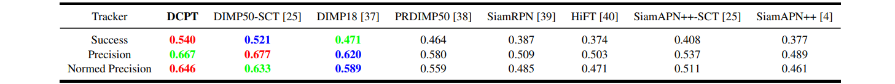

# DCPT
The official implementation for the **ICRA2024** paper [_DCPT: Darkness Clue-Prompted Tracking in Nighttime UAVs_](https://arxiv.org/abs/2309.10491).

[Models & Raw Results](https://pan.baidu.com/s/1fWDA6ccLcoxSEQK9X2A5Jg?pwd=0dof)
Baidu Driver: 0dof

[Models & Raw Results](https://drive.google.com/drive/folders/11XOu-ZKYNaJfPoK1e7hb1Npy5UoV38Fl?usp=sharing)
Google Driver

<p align="center">
  
</p>

## News
**Jan 29, 2024**
- DCPT is accepted to ICRA2024 :stuck_out_tongue_closed_eyes: .

**Nov 21, 2023**
- We release codes, models and raw results.

## Highlights

- :star2: A new unified nighttime tracking framework (no need for enhance then track paradigm).

- A gated feature aggregation mechanism is designed for effectively fusing the features between prompters and the foundation model.

- DCPT is with high parameter-efficient tuning, containing only 3.03M trainable parameters (~3%).

- DCPT achieves SOTA performance on four nighttime benchmarks.

## Results
### UAVDark135, NAT2021
<left></left>

### DarkTrack2021, NAT2021L
<left></left>
<left></left>

### Attributed-Based Analysis
<left></left>

## Presentation Demo
[](https://www.youtube.com/watch?v=DHNR2fvTZW8&t=29s "")

## Usage
### Installation
Create and activate a conda environment:
```
conda create -n DCPT python=3.8
conda activate DCPT
```
Install the required packages:
```
bash install.sh
```

### Data Preparation
Put the tracking datasets in ./data. It should look like this:
   ```
   ${PROJECT_ROOT}
    -- data
        -- bdd100k_night
            |-- images
            |-- annotations
            ...
        -- ExDark
            |-- images
            |-- annotations
        -- shift_night
            |-- 0b3d-e686
            |-- 0b4d-d96f
            ...
        -- trackingnet
            |-- TRAIN_0
            |-- TRAIN_1
            ...
            |-- TRAIN_11
            |-- TEST
   ```

### Path Setting
Run the following command to set paths:
```
cd <PATH_of_DCPT>
python tracking/create_default_local_file.py --workspace_dir . --data_dir ./data --save_dir ./output
```
You can also modify paths by these two files:
```
./lib/train/admin/local.py  # paths for training
./lib/test/evaluation/local.py  # paths for testing
```

### Training
Dowmload the pretrained [foundation model](https://drive.google.com/drive/folders/11XOu-ZKYNaJfPoK1e7hb1Npy5UoV38Fl?usp=sharing) (OSTrack with Corner Head) and put it under ./pretrained_models/.
```
python tracking/train.py --script DCPT --config DCPT_Gate --save_dir ./output --mode multiple --nproc_per_node 4 --use_wandb 0
```


### Testing
Download the model weights from [Google Drive](https://drive.google.com/drive/folders/11XOu-ZKYNaJfPoK1e7hb1Npy5UoV38Fl?usp=sharing) or [BaiduNetDisk](https://pan.baidu.com/s/1fWDA6ccLcoxSEQK9X2A5Jg?pwd=0dof)

Put the downloaded weights on `<PATH_of_DCPT>/output/checkpoints/train/DCPT/DCPT_Gate`

Change the corresponding values of `lib/test/evaluation/local.py` to the actual benchmark saving paths

Some testing examples:
- UAVDark135 or other off-line evaluated benchmarks (modify `--dataset` correspondingly)
```
python tracking/test.py DCPT DCPT_Gate --dataset uavdark135 --threads 16 --num_gpus 4
python tracking/analysis_results.py # need to modify tracker configs and names
```
- DarkTrack2021
```
python tracking/test.py DCPT DCPT_Gate --dataset darktrack2021 --threads 16 --num_gpus 4
python tracking/analysis_results.py # need to modify tracker configs and names
```
- NAT2021
```
python tracking/test.py DCPT DCPT_Gate --dataset nat2021 --threads 16 --num_gpus 4
python tracking/analysis_results.py # need to modify tracker configs and names
```
- NAT2021L
```
python tracking/test.py DCPT DCPT_Gate --dataset nat2021L --threads 16 --num_gpus 4
python tracking/analysis_results.py # need to modify tracker configs and names
```

### Test FLOPs, and Speed
```
# Profiling DCPT_Gate
python tracking/profile_model.py --script DCPT --config DCPT_Gate
```


## Acknowledgment
This repo is based on [OSTrack](https://github.com/botaoye/OSTrack) and [PyTracking](https://github.com/visionml/pytracking) library which are excellent works and help us to quickly implement our ideas.


## Citation
If our work is useful for your research, please consider citing:

```Bibtex
@article{zhu2023dcpt,
  title={DCPT: Darkness Clue-Prompted Tracking in Nighttime UAVs},
  author={Zhu, Jiawen and Tang, Huayi and Cheng, Zhi-Qi and He, Jun-Yan and Luo, Bin and Qiu, Shihao and Li, Shengming and Lu, Huchuan},
  journal={arXiv preprint arXiv:2309.10491},
  year={2023}
}
```
## Contact
If you have any question, feel free to email huayit1@uci.edu.
